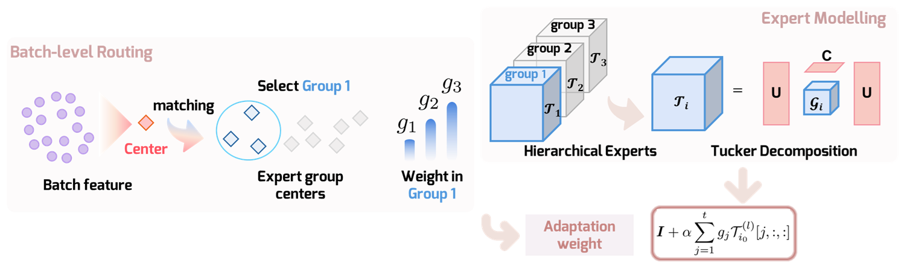

<div align=center>

# [AAAI 2026] TuckA: Hierarchical Compact Tensor Experts for Efficient Fine-Tuning

</div>

<div align="center">
  
</div>

## Introduction
This repository includes the official implementation of TuckA.

## Quick Start

To set up the environment using Anaconda:
```
conda create -n tucka python==3.10
conda activate tucka
pip install -r requirements.txt
bash install_tucka.sh
```

Running the mathematical reasoning task requires a separate environment:
```
conda create -n tucka-math python==3.10
conda activate tucka-math
cd math
pip install -U huggingface_hub
huggingface-cli download --repo-type dataset --resume-download fxmeng/pissa-dataset --local-dir pissa-dataset
pip install -r requirements.txt
pip install flash-attn --no-build-isolation
cd ..
bash install_tucka.sh
```

## Reproduce the Results

The baseline PEFT methods are included in the standard PEFT package installation. Our implementation of TuckA requires adding some code, so please run `bash install_tucka.sh` from the root directory of this repository before attempting to reproduce our results.

The pre-trained model weights and datasets used are all publicly available from the Hugging Face Hub and will be downloaded automatically when you run the code.

### NLU Tasks & Image Classification

Set the hyperparameters in `glue/train-glue.py`, then run:
```
conda activate tucka
python train-glue.py
```

For image classification, set the hyperparameters in `image_cls/train-*.py`, then run:
```
conda activate tucka
python train-*.py
```
Replace `*` with the dataset you want to run.

### Mathematical Reasoning

Set the hyperparameters in `math/scripts/run_*.sh`, then make sure your command line is in the `./math` directory and run:
```
conda activate tucka-math
bash scripts/run_*.sh
```
